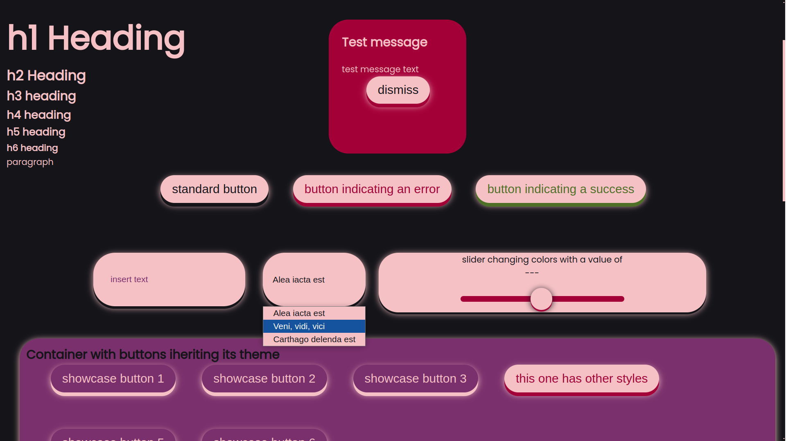

# enlightening-ui

A simple CSS UI library based on the UI that I am using in my blog website


## The goal of the library 

I wanted to share my little ui system that I use for my [blog](https://distantclicks.pl/).

The goal is to provide a nice-looking ui system. Capabilities include:

- Setting size and theme directly from HTML,
- assigning input elements to js events from HTML (TODO),
- everything with a responsible version,
- simple color adjustment through theme CSS files 

I want this library to be a little alternative to options like bootstrap, where you 
have the ready-to-go ui system, but which is also small and lightweight with minimal 
JS. In some aspects it also aims to replicate applying CSS attributes from HTML, like 
tailwind does.  

## Work in progress!

Keep in mind that the library is in its early stages. Core codebase is still going to change 
drastically, as I am experimenting with different ways to do stuff in CSS.


## Usage

```html
  <button class="ui danger" id="event-01">button indicating an error</button>
  <button class="ui positive" id="event-02">button indicating a success</button>
```

These lines are the last two of first three buttons seen in demo. the class "ui"
applies styles to an element designated for interactions (like buttons, forms, 
some links, etc.). Classes that come as second in the HTML snippet mainly 
affect the color accents.

This snippet of code creates an orange toggle switch:  

```
<label class="container toggle-cont orange">
  <input id="theme-toggle" class="toggle" type="checkbox">
  <span class="checkmark"></span>
</label>
```

## Idea behind the project

Some concepts of styling derive from bootstrap, as for eg. applying classes to make an entire
element have a different meaning (as for the classes 'danger' and 'positive' seen in the example.) 
The library heavily relies on CSS variables as well as inheritance of states of
each element.

Simple demonstration: 

Link to the deployed demo: [link](https://probablysomeman.github.io/enlightening-ui/)
